# Enterprise Network Deployment

**Group:** MAASNK  
**Members:** Muzan Abbas, Anisa Salsabila, Nooralhuda Khudhair

A small enterprise network deployed using Windows Server 2016, including Domain Controller, DHCP, DNS, IPSec VPN, and GPO configuration.

---

## Network Overview

```
[DC MAASNK]
Domain Controller + DNS + DHCP
192.168.164.60
        │
        ├── PC1MAASNK (192.168.164.65) — Domain joined, DHCP reserved
        │
        └── VPNMAASNK (LAN: 192.168.164.x / WAN: 11.0.0.1)
                │
             PC2MAASNK (WAN: 11.0.0.2) — Connected via L2TP/IPSec VPN
```

---

## Part 1 – Domain Configuration

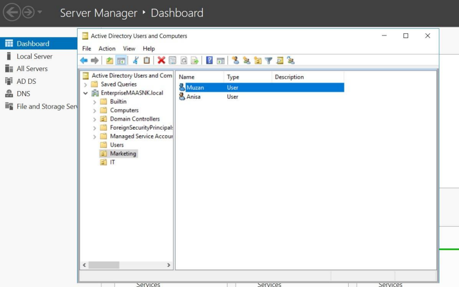
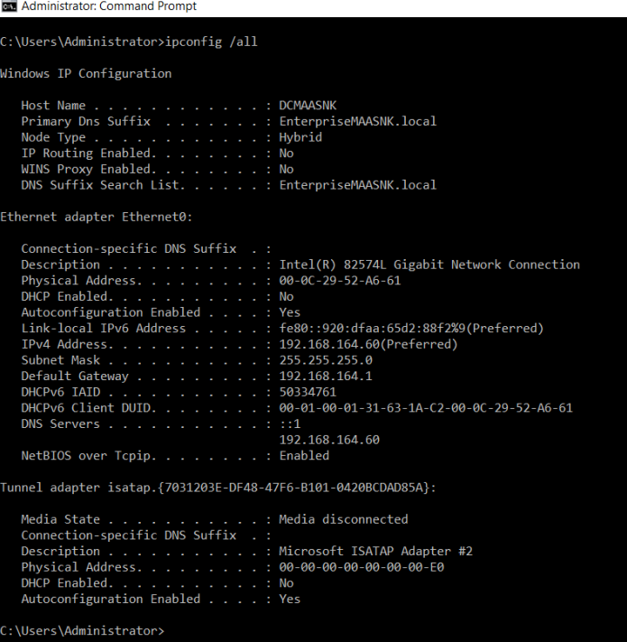
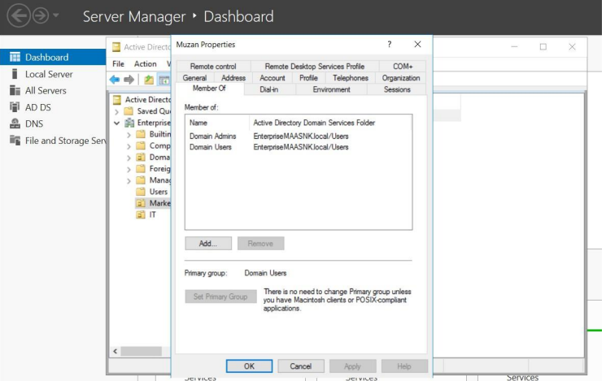

- **Domain:** EnterpriseMaaSNK.local
- **Organizational Units:** Marketing, IT
- **Users:** Muzan, Anisa (Marketing) | Noor, Ayesha (IT)
- **Admin User:** Muzan (member of Domain Admins)

| Setting | Value |
|---|---|
| Host Name | DCMAASNK |
| IPv4 Address | 192.168.164.60 |
| Subnet Mask | 255.255.255.0 |
| Default Gateway | 192.168.164.1 |
| DNS Server | 192.168.164.60 |
| DHCP Enabled | No (Static) |

---

## Part 2 – DHCP Configuration

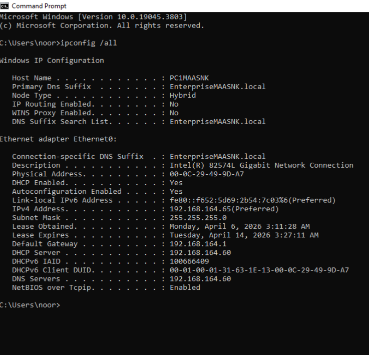
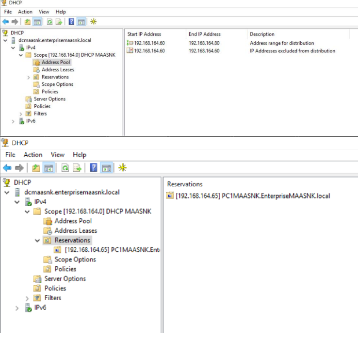

- **Scope:** 192.168.164.60 – 192.168.164.80
- **Reservation:** 192.168.164.65 → PC1MAASNK
- **PC1 joined to domain:** EnterpriseMaaSNK.local

| Setting | Value |
|---|---|
| Host Name | PC1MAASNK |
| IPv4 Address | 192.168.164.65 |
| DHCP Enabled | Yes (Reserved) |
| DHCP Server | 192.168.164.60 |
| DNS Server | 192.168.164.60 |

---

## Part 3 – IPSec VPN Configuration

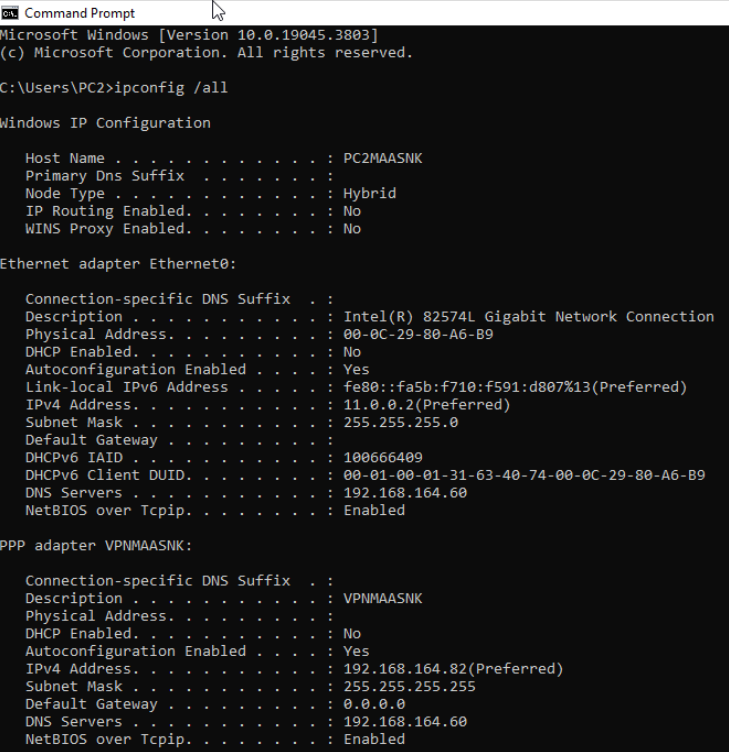
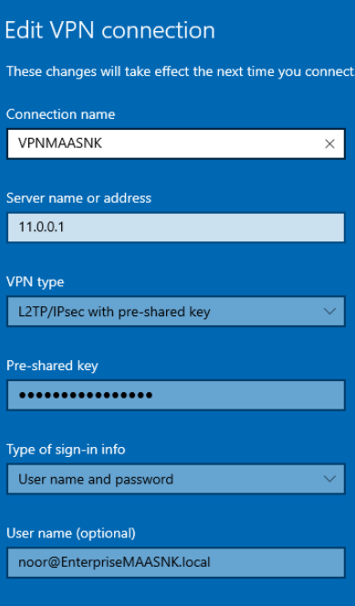
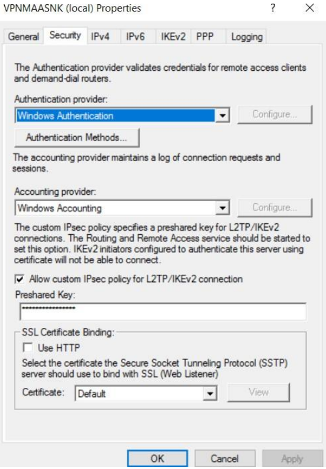
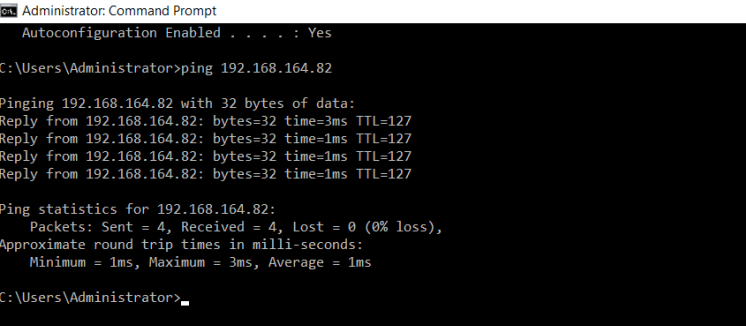

- **VPN Type:** L2TP/IPSec with pre-shared key
- **VPN Server:** VPNMAASNK (WAN: 11.0.0.1)
- **PC2 WAN IP:** 11.0.0.2 (static, no default gateway)
- **VPN Assigned IP to PC2:** 192.168.164.82
- **Ping Result:** 4/4 packets received, 0% loss

| Setting | Value |
|---|---|
| Host Name | PC2MAASNK |
| WAN IPv4 | 11.0.0.2 |
| VPN IPv4 | 192.168.164.82 |
| VPN Server Address | 11.0.0.1 |
| Authentication | Windows Authentication |

---

## Part 4 – DNS Configuration

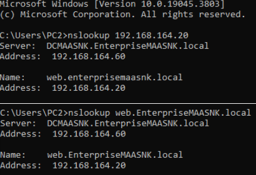

- **A Record:** web.EnterpriseMaaSNK.local → 192.168.164.20
- **PTR Record:** 192.168.164.20 → web.enterprisemaasnk.local
- Both forward and reverse lookups verified from PC2

---

## Part 5 – GPO Configuration

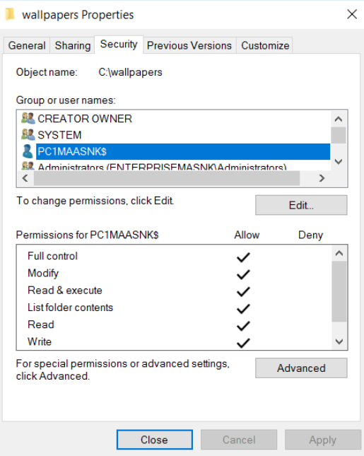
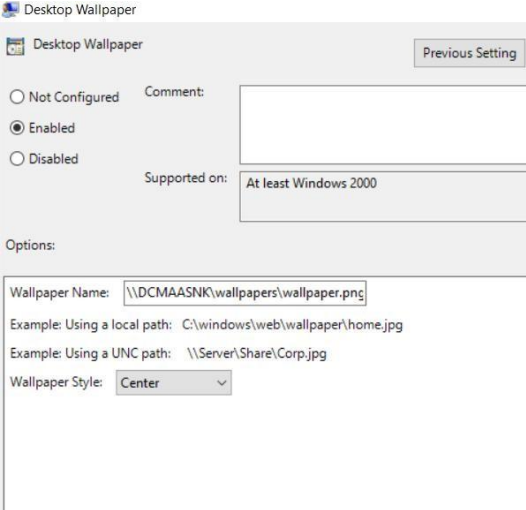
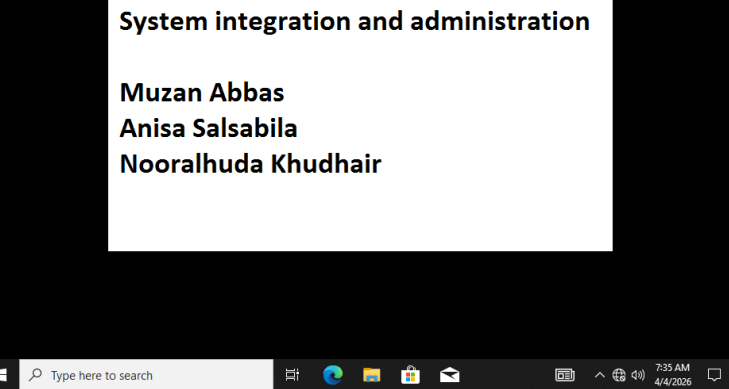

- **Wallpaper Path:** \\DCMAASNK\wallpapers\wallpaper.png
- **GPO Policy:** Desktop Wallpaper — Enabled
- **Applied to:** PC1MAASNK via Group Policy
- **Result:** Custom wallpaper successfully applied to PC1
